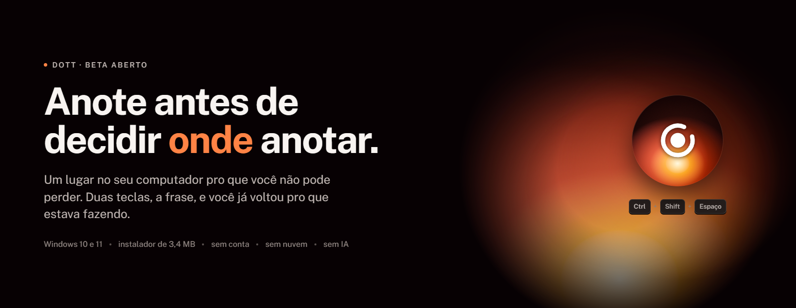
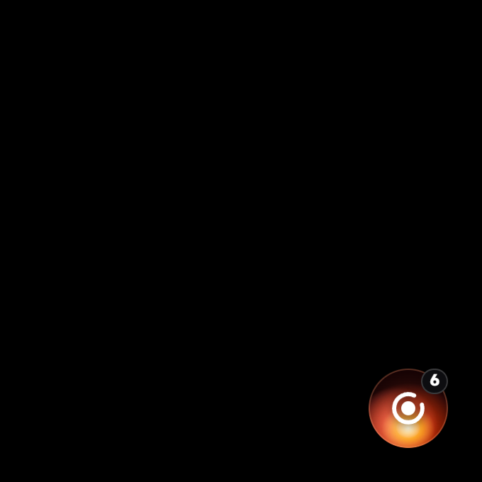
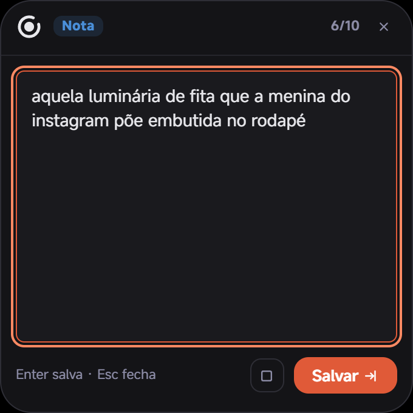
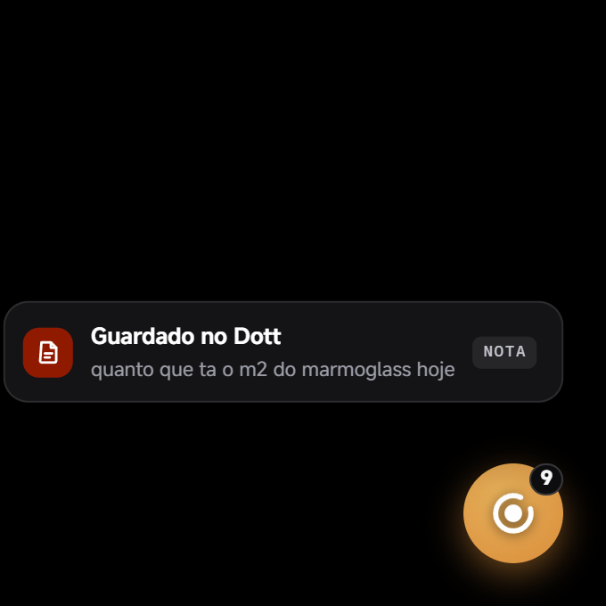
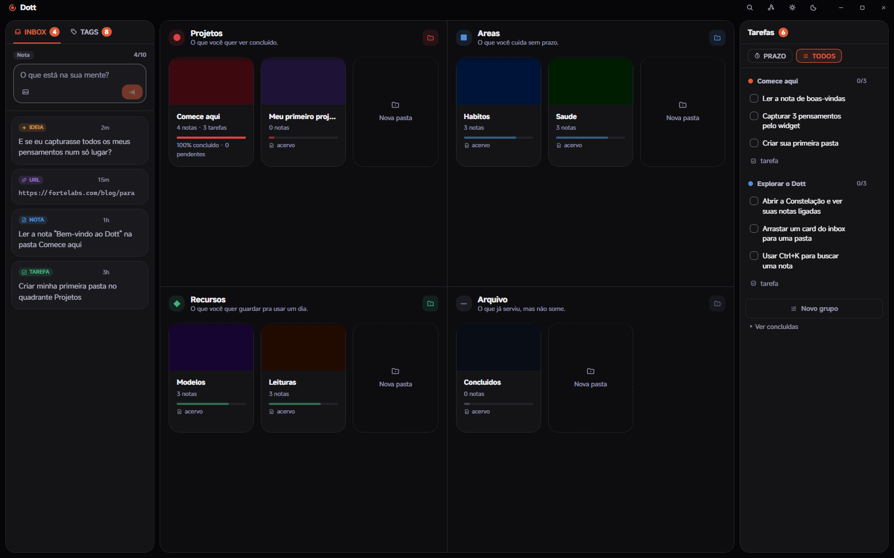
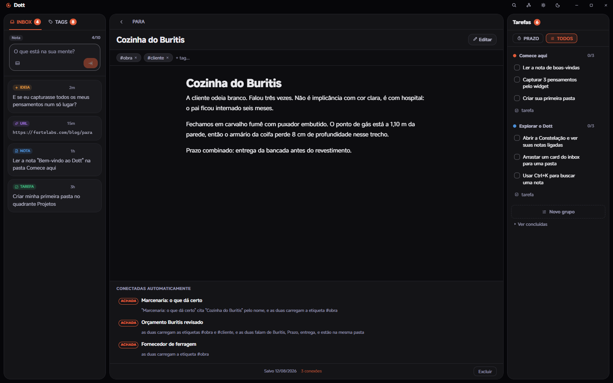
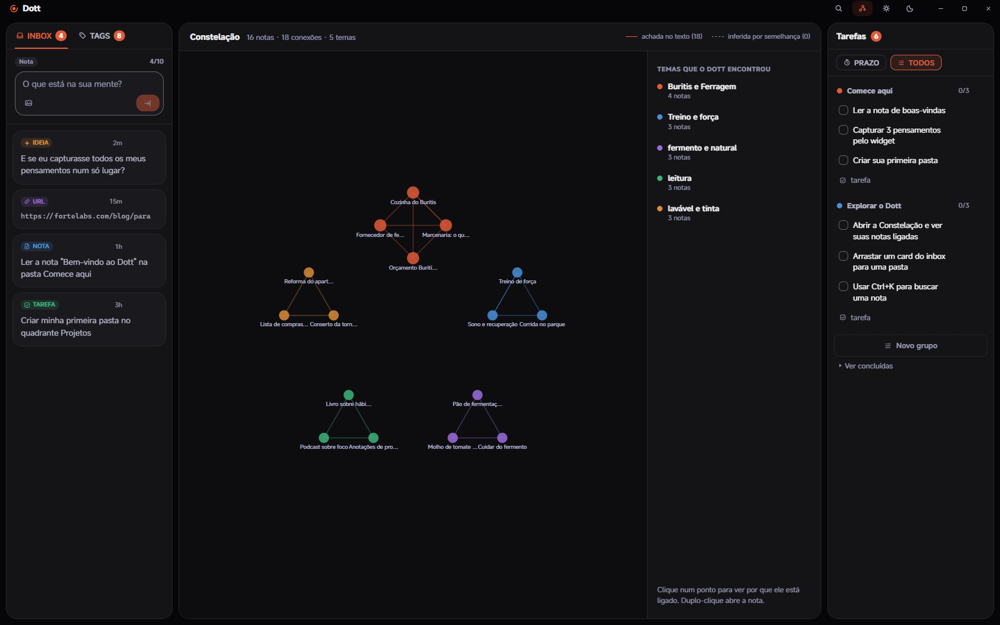
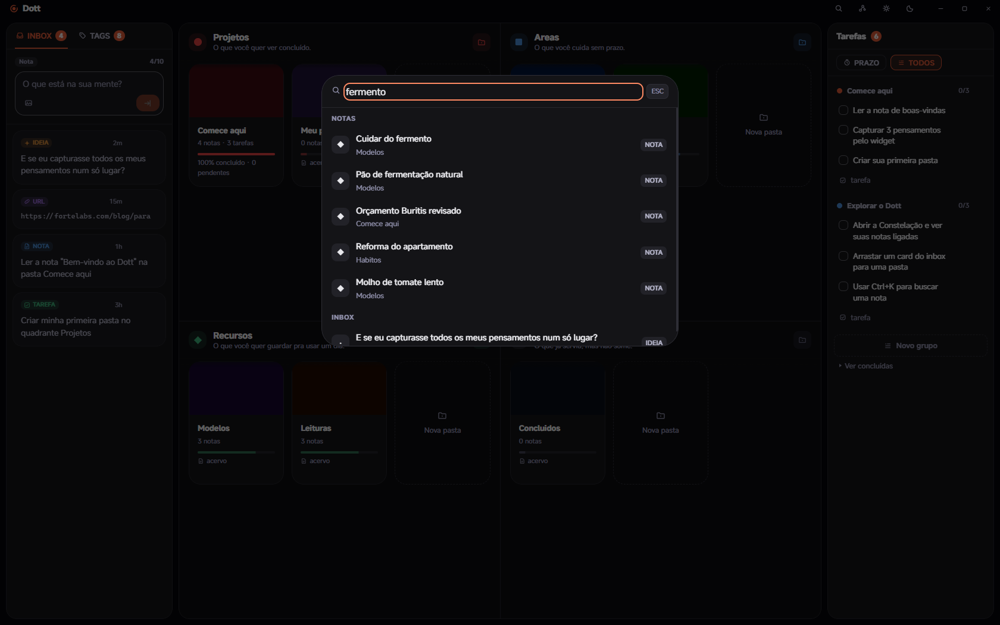
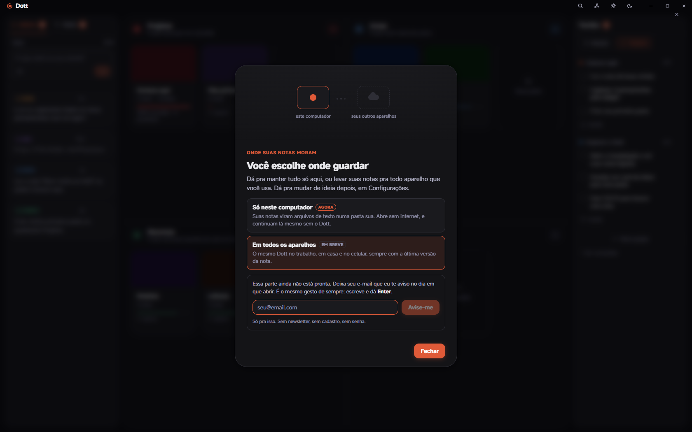

  

  <b><a href="https://github.com/gufarina/dott/releases/latest/download/Dott_1.0.0_x64-setup.exe">Baixar para Windows (3,4 MB)</a></b>
  &nbsp;&middot;&nbsp;
  <a href="https://github.com/gufarina/dott/releases">Todas as versões</a>
  &nbsp;&middot;&nbsp;
  <a href="https://github.com/gufarina/dott/issues">Achou um problema?</a>

  Beta aberto &middot; de graça &middot; sem cadastro &middot; suas notas são arquivos seus

---

## Você já viveu isso

Terça, 17h40, parada no trânsito. Você resolve de cabeça o problema que estava travado há três dias, sente aquele alívio curto de quem destravou, e pensa: chegando eu anoto.

Chegando tem lição de casa, jantar e um áudio de dois minutos e meio. Às nove da noite você senta na frente do computador e sabe que teve uma ideia boa. Você lembra do alívio. Não lembra da ideia.

Isso não é falta de memória. É que não existia, naquele minuto, um lugar barato o suficiente para ela caber.

O Dott é esse lugar.

## Como funciona

### 1. Guardar leva cinco segundos

Uma bolinha fica acesa num canto da sua tela, e ela é a única parte do Dott que continua ligada quando o Dott está fechado.

A ideia chega, você aperta `Ctrl` + `Shift` + `Espaço`, uma caixa aparece por cima do que você estava fazendo, você escreve a frase do jeito que ela saiu da sua cabeça e aperta `Enter`. Sem título, sem pasta, sem etiqueta. Se você acabou de copiar alguma coisa, ela já vem escrita na caixa.

  
  
  

### 2. A Caixa de Entrada para em dez

De propósito. No décimo item o Dott trava e não deixa você guardar mais nada até esvaziar.

Parece defeito, é o contrário: é a única razão de isso aqui não virar o mesmo paredão de quatrocentas linhas do bloco de notas. Esvaziar leva menos de um minuto. Você arrasta o item para uma pasta e ele vira uma nota, ou transforma em tarefa, ou joga fora sem culpa.

Você não precisa organizar. Você precisa esvaziar.

### 3. Quatro gavetas, já montadas

Projetos, Áreas, Recursos e Arquivo. Elas já vêm prontas, então não há o que configurar e não há o que abandonar. A pergunta que decide é sempre a mesma: isso tem fim, ou é para sempre?

  

### 4. As notas se ligam sozinhas

Aqui está a parte que nenhum caderno faz.

Você escreve do seu jeito, sem marcar nada, sem aprender sintaxe nenhuma. O Dott lê o que você escreveu e liga as notas que têm a ver umas com as outras. A anotação da reunião encontra o orçamento daquele cliente sem que nenhuma das duas cite a outra, porque as duas falam das mesmas coisas.

E ele nunca esconde de onde veio a ligação:

| | |
|---|---|
| **Achada** | Estava escrito no seu texto: você citou o nome da outra nota, ou as duas carregam a mesma etiqueta. |
| **Inferida** | O Dott deduziu por semelhança, porque as duas repetem as mesmas palavras raras. |

Se não houver parentesco de verdade, a nota fica sozinha mesmo. O Dott prefere ficar quieto a inventar uma conexão que não existe.

  

Na **Constelação** você vê o mapa inteiro. Cada ponto é uma nota, cada cor é um assunto que o Dott encontrou sozinho, e a linha entre dois pontos é uma ligação: cheia quando foi achada no texto, tracejada quando foi inferida.

  

Isso tudo roda dentro do seu computador, em alguns milésimos de segundo, sem internet e sem inteligência artificial. Não é um modelo lendo suas notas: é contagem de palavras, feita na sua máquina, e por isso é instantâneo e é de graça para sempre.

### 5. Achar depois é `Ctrl` + `K`

O começo da palavra já basta. A busca acha notas, pastas e itens da caixa de entrada.

  

## Onde as suas notas moram

Você escolhe. Hoje existe uma opção pronta e outra a caminho.

  

| | |
|---|---|
| **Só neste computador** | Disponível agora. Suas notas viram arquivos de texto numa pasta sua. Abrem em qualquer editor, hoje ou daqui a dez anos, mesmo que o Dott tenha deixado de existir. |
| **Em todos os aparelhos** | Em breve. Ainda estamos construindo. Dentro do app, na engrenagem, você deixa seu e-mail e é avisado no dia em que abrir. |

Enquanto a segunda não chega, nada sai da sua máquina: não existe conta para criar, não existe login para fazer, e nenhum modelo de inteligência artificial lê o que você escreve.

## Instalar

1. [Baixe o instalador](https://github.com/gufarina/dott/releases/latest/download/Dott_1.0.0_x64-setup.exe) (3,4 MB).
2. Na primeira vez, o Windows mostra um aviso de **"editor desconhecido"**. Clique em **Mais informações** e depois em **Executar assim mesmo**.
3. A instalação não pede senha de administrador e não pede permissão de rede.
4. Abra o Dott e aperte `Ctrl` + `Shift` + `Espaço`.

Se o seu Windows ainda não tiver o componente que o Dott usa para desenhar a tela (o WebView2, que o Windows 11 já traz), o instalador baixa esse componente na hora.

**Requisitos:** Windows 10 ou 11, 64 bits.

## A letra que não é miúda

Quatro coisas que o Dott ainda não faz. Melhor ler aqui do que descobrir depois de instalar.

- **Ainda não sincroniza entre computadores.** O que você escreve no computador do escritório fica no computador do escritório. Está sendo construído, e dá para entrar na lista de espera dentro do app.
- **Não tem versão de celular.** A ideia que chegou na rua ainda precisa esperar você sentar.
- **Não roda em Mac nem em Linux.** Só Windows 10 e 11, por enquanto.
- **O backup é você que manda fazer.** Ele copia tudo para uma pasta em Documentos, quando você clica. Nada acontece sozinho.

Se alguma dessas quatro for essencial para você hoje, este não é o programa. Sem ressentimento.

## Perguntas diretas

**É de graça mesmo?** 
É. Não tem preço, não tem plano, não tem cadastro e não tem cartão.

**Preciso ficar marcando as ligações entre as notas?** 
Não. Não existe nada para marcar. Você escreve, e o Dott liga. Se você citar o nome de outra nota no meio do texto, ele entende na hora, mas isso é consequência de escrever normal, não uma regra que você precisa lembrar.

**Isso é inteligência artificial lendo minhas notas?** 
Não. É contagem de palavras rodando na sua máquina, com regra fixa escrita à mão. Não existe modelo aqui dentro, nada sai do seu computador para ser processado em lugar nenhum.

**Preciso de internet para usar?** 
Não. Só na instalação, e só se faltar o WebView2. Depois disso funciona no avião, com o roteador desligado, sozinho.

**Onde ficam as minhas notas?** 
Em `%APPDATA%\com.studiofarina.dott`. Dentro do Dott, na engrenagem, tem um botão que abre essa pasta.

**E se um dia eu desinstalar?** 
Antes, clique em fazer backup: o Dott copia tudo para Documentos, Dott Backups. É uma pasta sua, e continua lá depois.

**Como aviso de um problema?** 
Abra uma [issue](https://github.com/gufarina/dott/issues) contando o que você fez e o que aconteceu. É beta: se algo quebrar, quebra na sua máquina e não sai de lá.

## Beta aberto

Esta é a primeira versão pública. O código do Dott ainda não é aberto, e este repositório existe para distribuir o programa e receber o que você tem a dizer sobre ele.

  Um produto <b>Studio Farina</b> &middot; Dott, um lugar no seu computador para o que você não pode perder.

