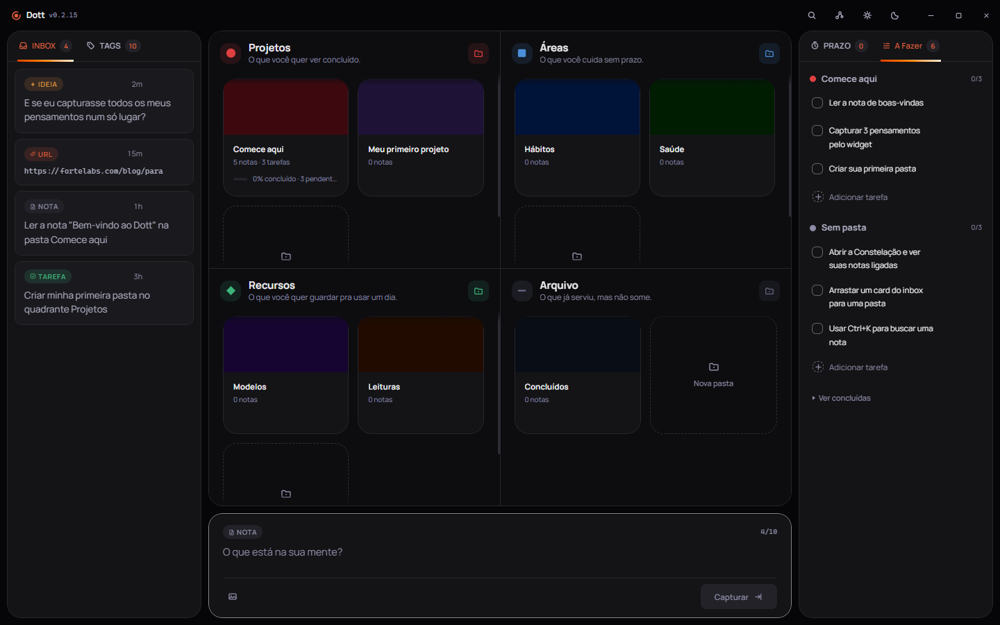
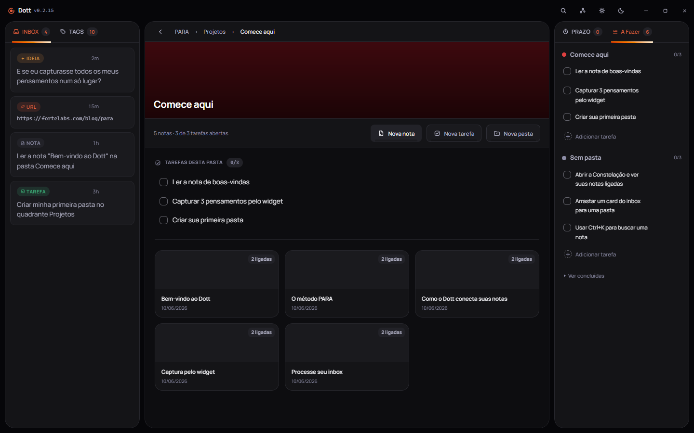
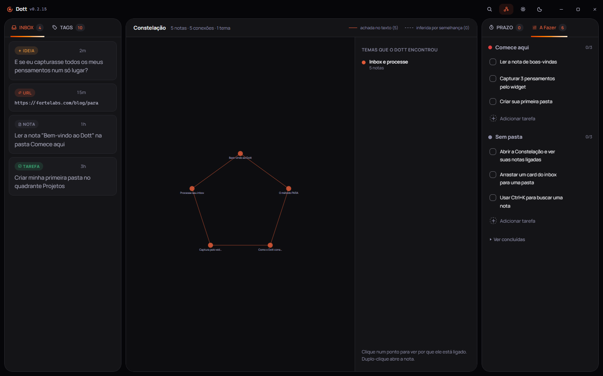

<p align="center">
  
</p>

# Dott

Você captura sem pensar onde, e o Dott descobre sozinho o que tem a ver com o quê.

É um programa de Windows que fica num cantinho da tela. A ideia chega, você aperta duas teclas,
escreve e volta pro que estava fazendo. Onde ela vai morar você decide depois, com calma, ou nunca.

<p align="center">
  <a href="https://github.com/gufarina/dott/releases/latest"><b>Baixar o Dott</b></a>
  <br>
  Windows 10 e 11 &middot; instalador de 2,9 MB &middot; de graça &middot; sem cadastro
</p>

## O problema que o Dott resolve

Você teve uma ideia boa no trânsito, no banho, no meio de outra tarefa. Pensou "depois eu anoto".
Só que "depois" tem lição de casa, jantar, um áudio de dois minutos. Na hora que você senta pra
anotar, lembra do alívio de ter resolvido aquilo, mas não lembra mais da ideia.

Não foi falta de memória. Foi que todo lugar onde você tenta anotar cobra alguma coisa antes da
primeira letra: abrir o programa certo, escolher a pasta, achar o título, decidir a etiqueta.
Quatro decisões para um pensamento de cinco segundos. Ninguém paga esse preço, e a ideia se perde.

O Dott tira essas decisões do caminho. Você escreve primeiro, organiza depois (ou nunca), e ele
mesmo encontra o que uma nota tem a ver com a outra.

## O que o Dott faz

### Captura em duas teclas, de qualquer lugar

<p align="center">
  
</p>

Aperte **Ctrl + Shift + Espaço** em qualquer lugar do Windows e uma caixinha abre por cima de tudo.
Você escreve, dá Enter, e ela desaparece sozinha. Não interrompeu o que estava fazendo, não abriu
janela nenhuma, não precisou decidir nada. Essa caixinha vive dentro de um Widget, uma bolinha que
fica discretamente acesa num canto da tela, sempre pronta.

### Uma Caixa de Entrada com teto de propósito

<p align="center">
  
</p>

Tudo que você captura cai primeiro numa Caixa de Entrada. Ela para em dez itens, de propósito: o
limite existe pra te lembrar de esvaziar, não pra você organizar cada coisa na hora. Cada item já
chega com uma etiqueta do que parece ser (uma ideia, um link, uma nota, uma tarefa), pra facilitar
a decisão quando você tiver um minuto.

### Quatro gavetas prontas, sem método pra aprender

<p align="center">
  
</p>

Projetos (o que você quer ver concluído), Áreas (o que você cuida sem prazo), Recursos (o que quer
guardar pra usar um dia) e Arquivo (o que já serviu, mas não some). Você não precisa criar
estrutura nenhuma: as quatro gavetas já vêm montadas, e cada pasta carrega junto as tarefas e as
notas daquele assunto.

### Nota é arquivo seu, não fica presa em lugar nenhum

<p align="center">
  
</p>

Quando algo merece mais espaço que um recado, vira uma Nota de verdade: título, etiquetas, texto
formatado enquanto você escreve. Por trás, é um arquivo de texto puro na sua própria máquina. Abre
em qualquer editor, hoje e daqui a dez anos, com ou sem o Dott instalado.

### As notas se conectam sozinhas, e o motivo aparece

<p align="center">
  
</p>

Essa é a parte que o Dott faz por você: ele lê o que você escreveu e liga notas que têm a ver uma
com a outra, sem você marcar nada. E cada ligação diz de onde veio: **ACHADA** quando há uma
etiqueta em comum ou uma nota citando a outra, **INFERIDA** quando o assunto se parece mesmo sem
citação direta. Sem parentesco real, a nota fica sozinha. O Dott prefere ficar quieto a inventar
uma ligação que não existe.

Essas ligações desenham a **Constelação**, um mapa das suas notas agrupado por Temas, os assuntos
que foram se formando sozinhos conforme você escreve.

### Busca rápida e tarefas junto do assunto

Aperte **Ctrl + K** pra achar qualquer nota ou pasta na hora. E cada pasta carrega as próprias
tarefas junto dela, então o que falta fazer num projeto fica ao lado do que você já escreveu sobre
ele, sem planilha separada.

## Como instalar

1. Clique em [baixar o Dott](https://github.com/gufarina/dott/releases/latest) e pegue o
   instalador para Windows 10 ou 11.
2. O Windows provavelmente vai mostrar um aviso de "Editor desconhecido" ou "Windows protegeu o
   computador". Isso é esperado: o Dott ainda não comprou a assinatura digital paga que faz esse
   aviso sumir, não é sinal de vírus. Clique em **"Mais informações"** e depois em **"Executar
   assim mesmo"**.
3. Siga o instalador. Não pede conta, não pede cartão, não pede e-mail.

## O que ainda não existe

O Dott está em beta aberto, então pode aparecer defeito. Se acontecer, conte pra gente abrindo uma
[Issue](https://github.com/gufarina/dott/issues) aqui no repositório.

Hoje suas notas moram só no computador onde você instalou o Dott. Sincronizar entre aparelhos está
a caminho: dentro do próprio app já dá pra entrar numa lista de espera pra ser avisado quando isso
chegar.

## Para quem quer mexer no código

Stack: Tauri 2 (núcleo em Rust) + React 19 + TypeScript + Vite + Zustand.

```
npm install
npm run tauri dev      # abre o app em janela, com hot reload
npm run tauri build    # gera o release e o instalador NSIS
```
