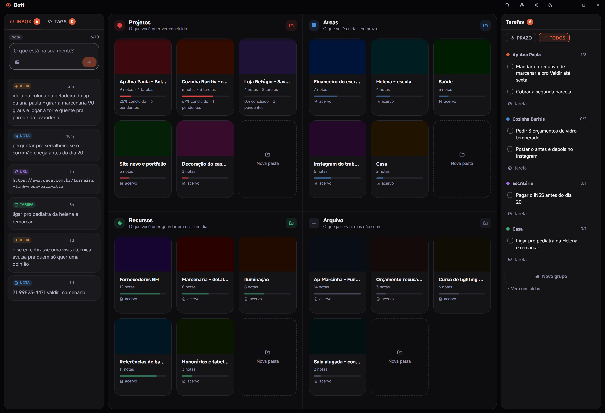
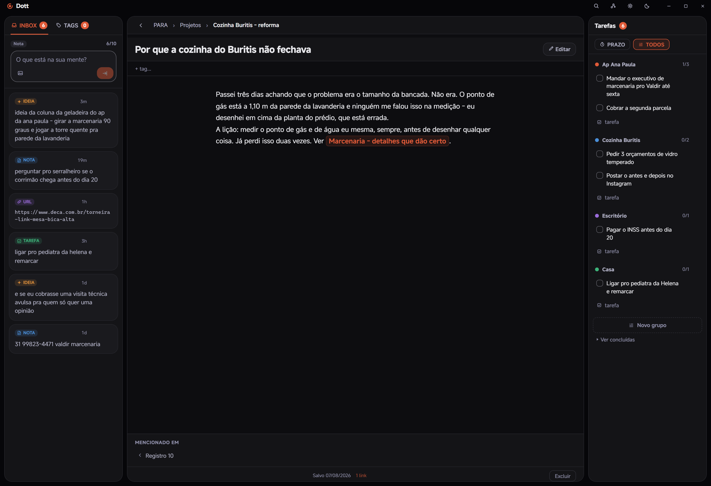
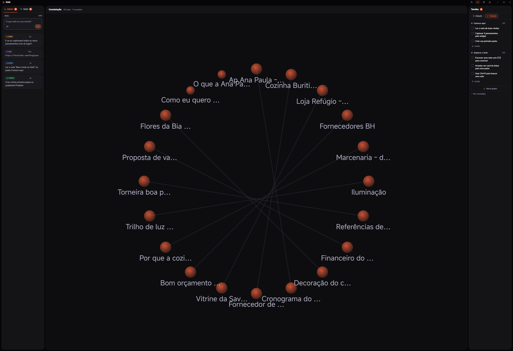
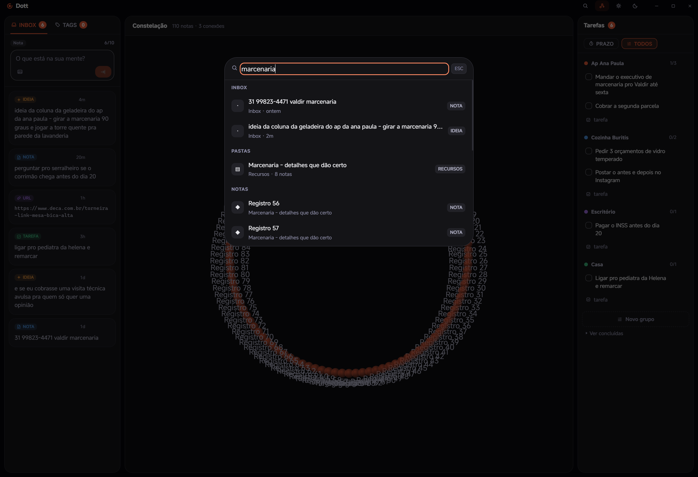

  

  <b><a href="https://github.com/gufarina/dott/releases/latest/download/Dott_1.0.0_x64-setup.exe">Baixar para Windows (3,4 MB)</a></b>
  &nbsp;&middot;&nbsp;
  <a href="https://github.com/gufarina/dott/releases">Todas as versões</a>
  &nbsp;&middot;&nbsp;
  <a href="https://github.com/gufarina/dott/issues">Achou um problema?</a>

  Beta aberto &middot; de graça &middot; sem cadastro &middot; suas notas ficam na sua máquina

---

## Você já viveu isso

Terça, 17h40, parada no trânsito. Você resolve de cabeça o problema que estava travado há três dias, sente aquele alívio curto de quem destravou, e pensa: chegando eu anoto.

Chegando tem lição de casa, jantar e um áudio de dois minutos e meio. Às nove da noite você senta na frente do computador e sabe que teve uma ideia boa. Você lembra do alívio. Não lembra da ideia.

Isso não é falta de memória. É que não existia, naquele minuto, um lugar barato o suficiente para ela caber.

O Dott é esse lugar.

## Como funciona

### 1. Guardar leva cinco segundos

Uma bolinha fica acesa num canto da sua tela, e ela é a única parte do Dott que continua ligada quando o Dott está fechado.

A ideia chega, você aperta `Ctrl` + `Shift` + `Espaço`, uma caixa aparece por cima do que você estava fazendo, você escreve a frase do jeito que ela saiu da sua cabeça e aperta `Enter`. Sem título, sem pasta, sem etiqueta. Se você acabou de copiar alguma coisa, ela já vem escrita na caixa.

  
  
  

### 2. A Caixa de Entrada para em dez

De propósito. No décimo item o Dott trava e não deixa você guardar mais nada até esvaziar.

Parece defeito, é o contrário: é a única razão de isso aqui não virar o mesmo paredão de quatrocentas linhas do bloco de notas. Esvaziar leva menos de um minuto. Você arrasta o item para uma pasta e ele vira uma nota, ou transforma em tarefa, ou joga fora sem culpa.

Você não precisa organizar. Você precisa esvaziar.

### 3. Quatro gavetas, já montadas

Projetos, Áreas, Recursos e Arquivo. Elas já vêm prontas, então não há o que configurar e não há o que abandonar. A pergunta que decide é sempre a mesma: isso tem fim, ou é para sempre?

  

### 4. Cabe coisa séria aqui dentro

Nem tudo que você precisa guardar tem tamanho de recado. No Dott uma nota tem o tamanho que precisar, em texto puro, com o formato que você quiser.

Quando uma nota fala de outra, você amarra as duas escrevendo o nome dela entre colchetes duplos. O Dott desenha essas ligações numa tela só, e você vê os fios entre coisas que pareciam soltas. Para achar qualquer coisa depois, `Ctrl` + `K` e o começo da palavra.

  
  

  

## Onde os seus dados estão

Promessa de privacidade é fácil de escrever e impossível de conferir. Então aqui não é promessa.

O Dott não tem, dentro dele, nenhum pedaço de programa que saiba conversar com a internet. Não foi desligado: nunca foi colocado. Não existe servidor para onde mandar, não existe conta para criar, não existe login para fazer.

| | |
|---|---|
| **Sem nuvem** | Tudo numa pasta do seu computador. |
| **Sem conta** | Baixou, abriu, escreveu. |
| **Sem modelo de IA** | Nenhum algoritmo lê suas notas, porque não tem nenhum aqui dentro. |
| **Sem sincronização** | Backup manual para uma pasta sua, quando você mandar. |

Suas notas são arquivos de texto numa pasta do seu computador. Você pode abrir cada uma delas em qualquer editor, hoje ou daqui a dez anos, mesmo que o Dott tenha deixado de existir.

## Instalar

1. [Baixe o instalador](https://github.com/gufarina/dott/releases/latest/download/Dott_1.0.0_x64-setup.exe) (3,4 MB).
2. Na primeira vez, o Windows mostra um aviso de **"editor desconhecido"**. Clique em **Mais informações** e depois em **Executar assim mesmo**.
3. A instalação não pede senha de administrador e não pede permissão de rede.
4. Abra o Dott e aperte `Ctrl` + `Shift` + `Espaço`.

Se o seu Windows ainda não tiver o componente que o Dott usa para desenhar a tela (o WebView2, que o Windows 11 já traz), o instalador baixa esse componente na hora. É a única vez que o Dott precisa de internet.

**Requisitos:** Windows 10 ou 11, 64 bits.

## A letra que não é miúda

Quatro coisas que o Dott não faz. Melhor ler aqui do que descobrir depois de instalar.

- **Não sincroniza entre computadores.** O que você escreve no computador do escritório fica no computador do escritório.
- **Não tem versão de celular.** A ideia que chegou na rua ainda precisa esperar você sentar.
- **Não roda em Mac nem em Linux.** Só Windows 10 e 11, por enquanto.
- **O backup é você que manda fazer.** Ele copia tudo para uma pasta em Documentos, quando você clica. Nada acontece sozinho, e nada sobe para lugar nenhum.

Se alguma dessas quatro for essencial para você, este não é o programa. Sem ressentimento.

## Perguntas diretas

**É de graça mesmo?** 
É. Não tem preço, não tem plano, não tem cadastro e não tem cartão.

**Preciso de internet para usar?** 
Uma vez só, na instalação, e só se faltar o WebView2. Depois disso funciona no avião, com o roteador desligado, sozinho.

**Onde ficam as minhas notas?** 
Em `%APPDATA%\com.studiofarina.dott`. Dentro do Dott, na engrenagem, tem um botão que abre essa pasta.

**E se um dia eu desinstalar?** 
Antes, clique em fazer backup: o Dott copia tudo para Documentos, Dott Backups. É uma pasta sua, e continua lá depois.

**Como aviso de um problema?** 
Abra uma [issue](https://github.com/gufarina/dott/issues) contando o que você fez e o que aconteceu. É beta: se algo quebrar, quebra na sua máquina e não sai de lá.

## Beta aberto

Esta é a primeira versão pública. O código do Dott ainda não é aberto, e este repositório existe para distribuir o programa e receber o que você tem a dizer sobre ele.

  Um produto <b>Studio Farina</b> &middot; Dott, um lugar no seu computador para o que você não pode perder.

